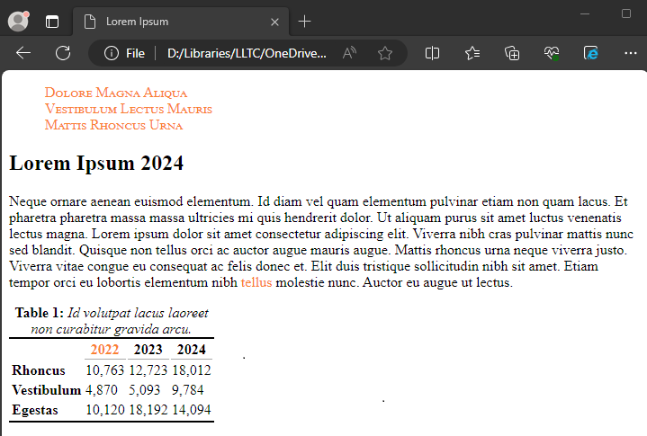
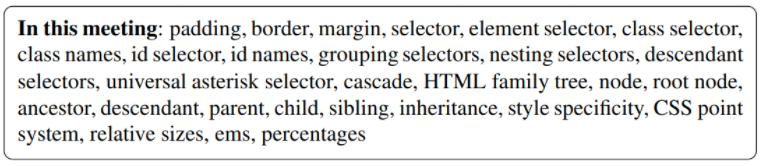

# Instructions  

For this week's lab, you will attempt to replicate the following page.

The text is all gibberish, but that's fine. You can feel free to use [your own Lipsum text](http://www.lipsum.com) if you like, but it might be easier to just use this text (or something close to it). Seriously, the text doesn't need to be exactly the same. There just needs to be the same _amount_ of it.

A couple notes:

* All gray text are considered to be links. Therefore, at the top of the page is meant to be a list of links (a navigation bar).
* For all links feel free to use `href="#"` for each of these.     
* Pay attention to the case of the text in the heading and the navigation bar. For a hint, check out the [font-variant property](https://www.w3schools.com/cssref/pr_font_font-variant.asp).
* You will have to use several classes to make your page look exactly like the image. So think carefully about where you might use these classes.
* This time, we _have_ covered everything you need to know to accomplish this. But you will possibly have to use Google just a little bit to help out. The reference at the end of the text should also be helpful.

Here's the list of keywords from this chapter:

